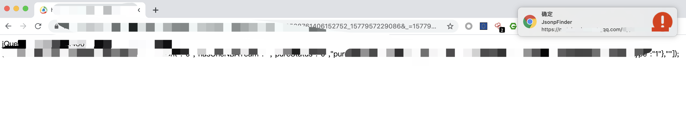
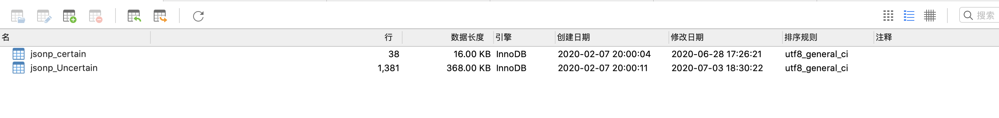

# JsonpFinder

### 描述
- 年初出于需求写的辅助挖掘Jsonp插件，用于攻击者身份溯源等

### 原理
模糊匹配+精准匹配
- 模糊匹配：Jsonp调用检测+敏感字段返回检测
```
  function CheckCallback() {
    Result = /[\?\&](callback|jsonp|cb|function)=([^\&]*)(\&?)/i.test(details.url);
    if (Result) { GetHeader(); }
    return Result;
  }

  function CheckResponseback(data) {
    Result = /[\"\'](uid|user_id|uin|name|username|nick|usernickname|phone|mail)([^\&]*)(\&?)/i.test(data);
    if (Result) { return 1; }
    return 0;
    
```

- 精准匹配：录入检测信息字段+精准字段返回检测

keyUrl与KeyRegular为一一对应需要获取指定域的精准字段

例：想找能打到qq昵称的Jsonp，登录qq作用域插件会自动录入qq昵称用于后面的自动挖掘（也可以直接修改代码更改固定敏感字段），当检测到返回数据中包含qq昵称且url中没有token等校验字段的jsonp请求就判断为精准
```
var keyUrl = {
  0: 'https://vip.qq.com/my/index.html?ADTAG=vip.qq.com/my/index.html', //qq昵称
  ...
};

var KeyRegular = {
  0: '<span class="ui-navbar-status-username">(\\\S*)<\\\/span>', //qq昵称
  ...
};
```

### 使用
- 单独使用版本-Client: 
当发现精准jsonp及模糊jsonp时，会弹窗，点击窗口可直接复制url (chrome开通通知)


- 多用户使用版本-Server: 
RegUrl.php为远程更新字段文件；ttt.php为服务端接收文件


